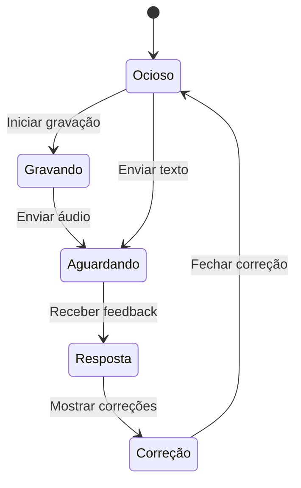

# ADR 0002 - Arquitetura Frontend do Tutor de Inglês

## Status

Aceito

## Contexto

A aplicação deve fornecer uma interface de conversação com um professor virtual de inglês. A interface simula um chat, permite envio de voz ou texto, apresenta correções, sugestões didáticas e exibe o progresso do aluno. A solução precisa funcionar offline e ser simples para uso em dispositivos locais.

## Decisão

A aplicação frontend será construída com:

- **Framework**: React 18 + Vite
  - Escolhido por sua performance, facilidade de desenvolvimento e amplo ecossistema
  - Vite oferece build rápido e HMR eficiente

- **Estilização**: TailwindCSS + ShadCN/UI
  - TailwindCSS para estilização utilitária e responsiva
  - ShadCN/UI para componentes acessíveis e customizáveis

- **Gerenciamento de estado**: Zustand
  - Solução leve e simples para gerenciamento de estado
  - Suporte a persistência para funcionalidade offline

- **Comunicação com backend**: REST via Axios
  - Cliente HTTP robusto com suporte a interceptors
  - Cache e retry configuráveis

- **Áudio**: Web Audio API + MediaRecorder API
  - APIs nativas para manipulação de áudio
  - Suporte cross-browser para gravação e reprodução

### Funcionalidades Principais

| Funcionalidade | Implementação | Benefícios |
|----------------|---------------|------------|
| Interface de chat | Componentes de mensagem com avatar e timestamp | UX familiar e intuitiva |
| Gravação de voz | MediaRecorder com feedback visual | Experiência fluida de input |
| Reprodução TTS | Web Audio API com controles | Aprendizado de pronúncia |
| Correção inline | Sistema de highlight + tooltips | Feedback imediato |
| Barra de progresso | Indicador CEFR (A1-C2) | Motivação visual |
| Perfil de usuário | Configurações persistentes | Personalização |

### Estados da Interface

- **Ocioso**: Interface pronta para input
- **Gravando**: Feedback visual da captura de áudio
- **Aguardando**: Loading state com animação
- **Resposta**: Exibição de texto e áudio
- **Correção**: Highlighting e tooltips de feedback

## Consequências

### Positivas
- Interface moderna e responsiva
- Operação offline first
- Feedback imediato ao usuário
- Extensível para novos modos de estudo
- Performance otimizada

### Considerações
- Necessidade de testes em diferentes dispositivos
- Gestão de cache para modo offline
- Sincronização eventual com backend

## Próximos Passos

1. **Sistema de Lições**
   - Implementar árvore de progressão CEFR
   - Desenvolver sistema de achievements

2. **Perfis Múltiplos**
   - Storage com IndexedDB
   - Sincronização em background

3. **TTS Avançado**
   - Integração com múltiplas vozes
   - Controle de sotaque e velocidade